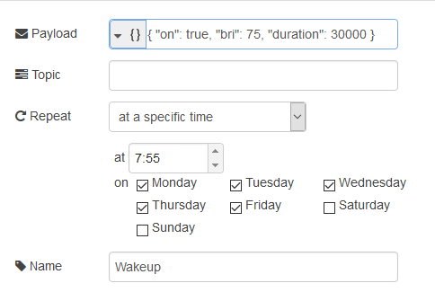

# Philips Hue nodes for Node-Red
An solution to control Philips Hue lights using Node-Red, uses [node-hue-api library](https://github.com/peter-murray/node-hue-api) for communicating with the lights.

This module provides input and output nodes for communicating with Philips Hue lights, the input node accepts multiple color format and automatically converts the values to the right format. 


### Features
* Control both groups and individual lights.
* Handles automatic conversion of rgb/hsv/hex/xy/.. color space to light specific color space
* Trigger events for light changes
* Self syncing, uses background polling to detect external changes to light
* Displays current state for light in the Node-Red ui

#### TODO
* The HSV to XY (and back) color conversion is not 100% correct, modifying single color channel at a time can produce strange results.


### Examples
##### Dashboard example config:
This is an example of how to control the light using the [node-red-dashboard](https://github.com/node-red/node-red-dashboard)
The split node is used to get the `on` and `bri` payload from the light status message, and the join is used to combine the topic and value to an JSON object.


##### Wakeup example config:
Simple example of using an inject node to trigger an wakeup light behavior every workday, the light transitions from off to on with 75% brightness over an duration of 30s.



##### Hub Configuration


##### Light Configuration


### Input node
The light is controlled by sending message with an payload containing the new state

Simplified control by sending the following values as payload

| Value | Info |
|---|---|
| `'on'` or `true` | Turn light on |
| `'off'`or `false` | Turn light off |
| numeric value | Turn light on and set brightness (0-100%) |

More advanced way to control the light is to send an object payload with one or more of the following properties set

| Property | Info |
|---|---|
| `on` | Set light state (true/false)|
| `red`, `green` and/or `blue` | Set one or more color channel for light (0-255)|
| `hex` | Set color (#f49242) |
| `hue` | Set color hue (0-360) |
| `xy` | Set XY color (array with 0.0-1.0 values) |
| `x` and/or `y`| Set XY color (0.0-1.0) |
| `sat` or `saturation` | Set color saturation (0-100) | 
| `bri` or `brightness` | Set light brightness (0-100%) |
| `ct`, `mired` or `mirek` | Set Mired color temperature (153 - 500) |
| `kelvin` | Set kelvin color temperature (2200-6500) |
| `duration` | Transition time (ms) |
| `alert` | Alert effect ('none', 'select' or 'lselect') |
| `effect` | Dynamic effect ('none' or 'colorloop') |

Example: Sending the following to the light will turn it on and dim it upp to 77% over 10 seconds

```json
{
  "payload": {
    "on": true, 
    "bri": 77,
    "duration": 10000
  }
}
```


### Output node

Example output from change event 
```json
{
  "id": "light3",
  "info": {
    "id": "3",
    "name": "Bedroom 1",
    "capability": [ "bri", "ct" ],
    "group": false,
    "type": "Color temperature light",
    "uniqueid": "00:17:88:01:02:06:ef:5c-0b",
    "modelid": "LTW001"
  },
  "payload": {
    "on": true,
    "reachable": true,
    "bri": 12,
    "xy": [ 0.3244, 0.3373 ],
    "hsv": [ 27, 10, 12 ],
    "rgb": [ 31, 29, 28 ],
    "hex": "1F1D1C",
    "color": "black",
    "mired": 189,
    "kelvin": 5291
  },
  "state": {
    "on": true,
    "bri": 31,
    "ct": 189,
    "colormode": "ct"
  },
  "event": "change"
}
```


# Using withouth Node-RED
This library can be used independent from Node-RED, the [example/mqtt.js](./example/mqtt.js) file contains an simple example using [MQTT.js](https://github.com/mqttjs/MQTT.js) to enable control an lights on/off status and brightness over MQTT.

The MQTT topic `lights` will contain an list of all currently detected lights.
Specific light can be controlled by sending an message to the topics `lights/<id>/on` (boolean) or `lights/<id>/brightness` (number) with the new state.
